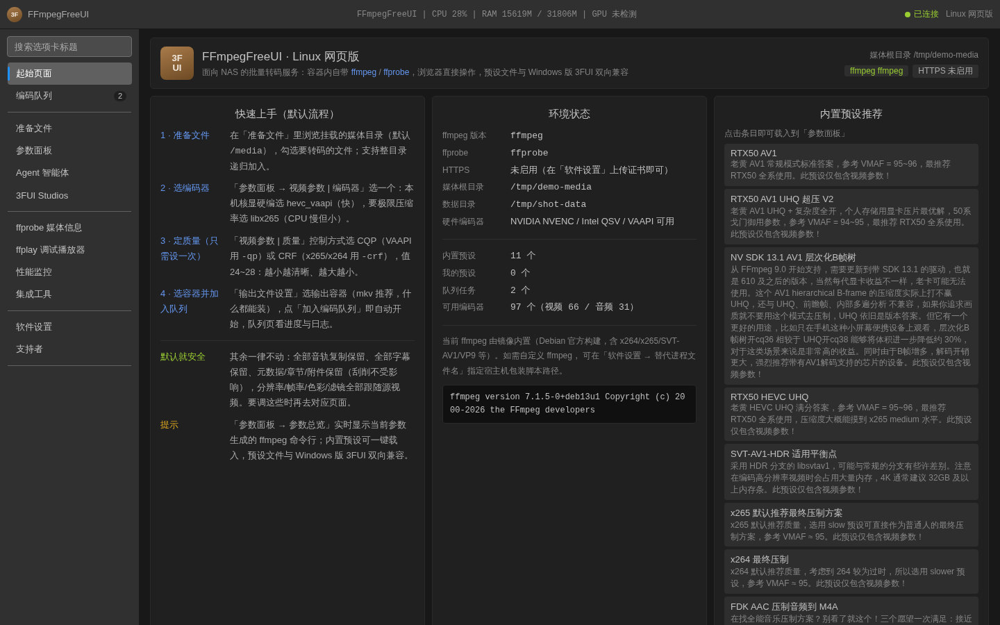
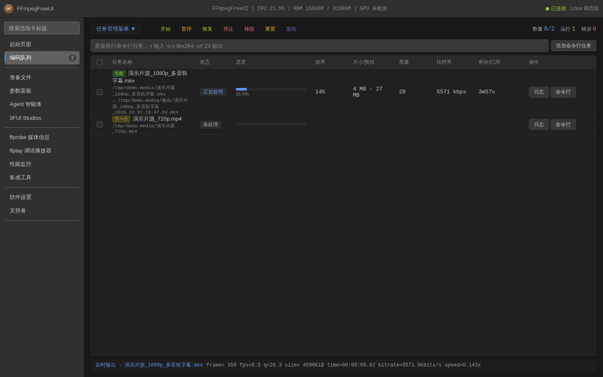
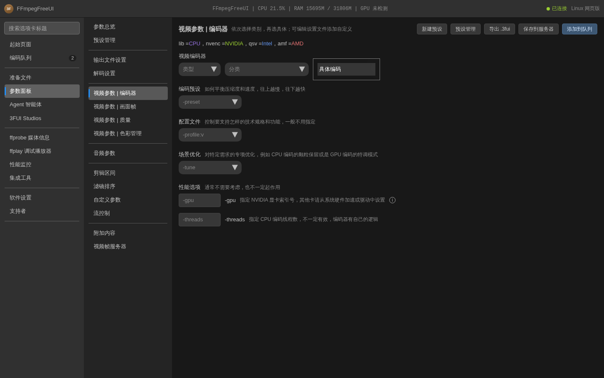
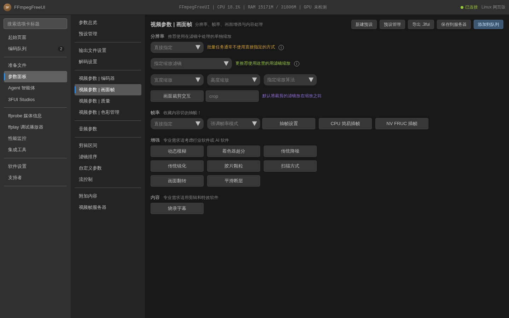
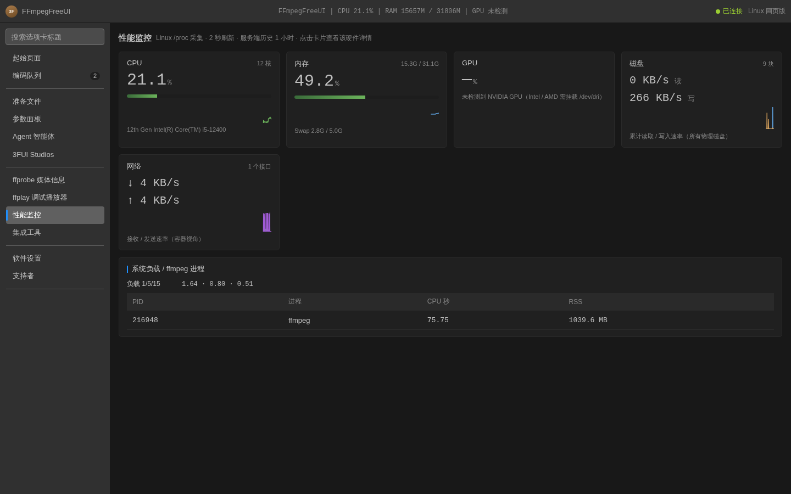
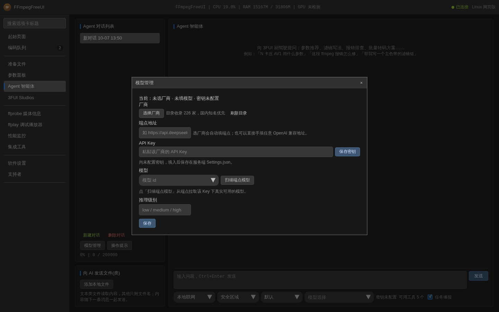

# linux-3fui

FFmpegFreeUI（3FUI）的 **Linux / 网页移植版**：为 NAS 打造的批量转码服务。

- **功能一致性**：核心逻辑（预设数据模型、ffmpeg 命令行生成、编码队列、进度解析）直接移植自 3FUI v6.2.26 源码（VB.NET），经 112 项上游回归测试在 Linux 上验证通过
- **预设互通**：`.3fui` 预设文件与 Windows 版 **双向兼容**——Windows 上保存的预设直接导入使用，反之亦然
- **网页前端**：复刻 3FUI v6 暗色毛玻璃风格（起始页/准备文件/参数面板/编码队列/Agent/设置）
- **声明式 HTTPS**：网页上传证书立即生效（无需重启容器）；删除即停用；证书持久化于数据卷
- **远程调用**：UDP 协议与 Windows 版 3FUI 一致（默认端口 10591），局域网自动化零改动迁移。⚠️ 该协议**无认证**（协议兼容所致，可下发任意 ffmpeg 参数）——只在可信局域网开启「设置 → 监听端口」，公网环境务必启用登录认证且防火墙不放行 10591/udp
- **Agent**：接入任意 OpenAI SDK 兼容端点（DeepSeek/Kimi/OpenAI/Ollama…），流式输出，密钥仅存服务端；
  「模型管理」内置 models.dev 厂商目录（国内知名 → 国外知名 → 其他，带搜索），选厂商自动填端点，
  并可一键扫描端点自身的 `/models` 拉取该 Key 下真实可用的模型；
  **工具化**：Agent 能真正操作软件本体——读/改参数面板、管理预设、查看与控制编码队列、读任务日志、探测媒体文件、
  按三档权限（安全区域 / 环境控制 / 系统访问）放行，**写操作逐次弹确认卡**，可随时停止；
  **看得见思考**：推理模型的思考过程单独显示并可折叠；
  **harness 通告**：任务开始/进度/报错/编码器切换会以 `⚙ harness 通知` 主动播报给 Agent（可开关）；
  另有内置技能资料库（参数面板/命令行自检/滤镜与流控制/队列/硬件编码器）供 Agent 自查

## 界面预览

截图取自**真实运行实例**（本机 Linux + ffmpeg 7.1.5，队列里真在跑一个 x265 任务；测试机无独显，所以 GPU 显示「未检测」）。
点击图片可看原尺寸。

|  |  |
|---|---|
| [](docs/images/home.png) | [](docs/images/queue.png) |
| **起始页面**：小白默认流程（准备文件 → 选编码器 → 定质量 → 入队）、环境状态、内置预设推荐 | **编码队列**：当前/下一个徽标、进度与效率、大小预估、底部 ffmpeg 实时输出条 |
| [](docs/images/preset-encoder.png) | [](docs/images/preset-frame.png) |
| **参数面板 · 编码器**：先选类别再选具体编码，字段右侧是与原版一致的参数说明 | **参数面板 · 画面帧**：复刻原版的二级窗口——分辨率/帧率/增强按块展开 |
| [](docs/images/perf.png) | [](docs/images/agent.png) |
| **性能监控**：CPU/内存/磁盘/网络卡片 + 实时曲线 + ffmpeg 进程占用 | **Agent 智能体**：模型管理（models.dev 厂商目录 / 端点 / 密钥 / 模型扫描） |

## 快速开始

四种装法，按场景选一种（都自带网页前端）。版本号与下载地址见
[Releases](https://github.com/nas200-timmy/linux-3fui-wedui/releases)。

### ① 容器镜像（NAS 首选，不用本地构建）

```bash
docker pull ghcr.io/nas200-timmy/linux-3fui-wedui:latest
# 或者直接用本仓库的 compose（image 已指向上面这个地址）：
cp .env.example .env      # 填 DATA_DIR（数据目录）与 MEDIA_HOST_DIR（宿主媒体库）
docker compose pull && docker compose up -d
```

打开 `http://NAS的IP:8080`（在「设置」上传证书后自动跳转 `https://NAS的IP:8443`）。
镜像同时提供 amd64 与 arm64。

### ② 本地构建部署（改过代码 / 想完全离线）

```bash
cp .env.example .env      # 填 DATA_DIR 与 MEDIA_HOST_DIR
./tools/deploy.sh --build
```

`deploy.sh` 部署前自动检查并尽量修复：镜像是否存在（没有会先尝试拉预构建镜像）、GPU 清点、
NVIDIA runtime、`group_add` 与宿主 video/render 组是否匹配（不匹配就写一份
`docker-compose.override.yml`——不动受版本控制的 compose，避免部署机工作区 dirty）、
媒体目录属主、端口占用；部署后自动跑编码器探针矩阵（`tools/check-hw.sh`），
任何一层不通都会给出具体修复命令。裸用 `docker compose up -d --build` 亦可。

### ③ deb / rpm（裸机，装到 /opt/linux-3fui，systemd 托管）

```bash
sudo apt install ./linux-3fui_<版本>_amd64.deb        # Debian/Ubuntu（arm64 同理）
sudo dnf install ./linux-3fui-<版本>-1.x86_64.rpm     # Fedora/RHEL
sudo vi /etc/linux-3fui/env      # 改 MEDIA_ROOT=你的媒体库
sudo systemctl restart linux-3fui
```

装完是一个 systemd 服务：`systemctl status linux-3fui` / `journalctl -u linux-3fui -f`；
数据在 `/var/lib/linux-3fui`（卸载不删），配置在 `/etc/linux-3fui/env`（`config`，升级保留你的改动）；
排障可前台跑 `linux-3fui`（读同一份配置）。

**裸机部署的前提（包里不捆绑，需要宿主提供）**：

| 依赖 | 说明 |
|---|---|
| `ffmpeg` / `ffprobe` | 必装。debian 包会作为依赖自动装；Fedora 的 ffmpeg 在 RPM Fusion，需自行启用（缺了装完会打印提示） |
| `libicu` | self-contained .NET 的运行时依赖，Debian/Ubuntu 任意版本（76/74/72/70）均可，包已声明依赖 |
| `fonts-noto-cjk` | 建议装：烧录中文字幕要用（不装则字幕缺字） |
| VA-API / QSV 驱动 | 要做硬编才需要：宿主 `/dev/dri` + 对应用户态驱动；服务用户已自动加入 `video`/`render` 组 |
| 端口 | 8080 HTTP、8443 HTTPS、10591/UDP（与 Windows 版 3FUI 的远程调用协议一致） |

### ④ 免安装（tar.gz，解包即用）

```bash
tar -xzf linux-3fui-<版本>-linux-x64.tar.gz -C /opt/linux-3fui
MEDIA_ROOT=/你的媒体库 /opt/linux-3fui/3fui-server
```

需要宿主自带 `ffmpeg`/`ffprobe` 与 `libicu`。数据默认落在**可执行文件同级**的 `data/`（用 `DATA_DIR` 可改），
静态前端也按可执行文件同级目录解析，**工作目录在哪都行**。

> 没有"单文件二进制"这个产物：ASP.NET Core 的 `wwwroot` 不参与 single-file 打包（实测连
> `IncludeAllContentForSelfExtract=true` 也收不进去），单文件发出来会是个没有界面的 exe。
> 想彻底单文件，需要把前端做成嵌入资源（改动在服务端，另说）。

**装完都一样：**
1. 「设置」→ 上传证书（cert.pem + key.pem）启用 HTTPS
2. 「准备文件」浏览 `/media`（或你配的 MEDIA_ROOT）选择待转码文件
3. 「参数面板」→「预设管理」→ 导入 Windows 版导出的 `.3fui` 预设（可选）
4. 「参数面板」→「添加到队列」→「编码队列」监控进度

### 开发构建

```bash
# 需要 .NET SDK 10 与 Node.js 22
cd src/3fui-web && npm install && npm run build   # 前端产物输出到 ../3fui-server/wwwroot
cd ../3fui-server && dotnet run                   # http://127.0.0.1:8080

# 核心回归测试（命令行生成与 Windows 版一致性证明）
cd tests/3fui-core.Tests && dotnet run -- --ffmpeg /usr/bin/ffmpeg
```

## 环境变量

| 变量 | 默认 | 说明 |
|------|------|------|
| `DATA_DIR` | `./data` | 数据目录（设置/预设/队列缓存/HTTPS 证书） |
| `HTTP_PORT` | `8080` | HTTP 端口（TLS 启用后 301 跳转 HTTPS） |
| `HTTPS_PORT` | `8443` | HTTPS 端口（恒常监听，证书就绪即握手成功） |
| `MEDIA_ROOT` | `/media`（存在时） | 媒体根目录，网页文件浏览限制在此范围内 |
| `TLS_CERT_PATH` | — | 声明式 HTTPS：证书文件路径（优先级高于网页上传） |
| `TLS_KEY_PATH` | — | 声明式 HTTPS：私钥文件路径 |

## 硬件加速（NAS 转码必读）

Docker 内自带 Debian 官方 ffmpeg（含 VAAPI/QSV）。使用硬件编码时：

- **Intel QSV / AMD VAAPI**：compose 中取消注释 `devices: - /dev/dri:/dev/dri`
- **NVIDIA NVENC**：宿主机安装 NVIDIA Container Toolkit，compose 中取消注释 `runtime: nvidia`
- **arm64 NAS**：镜像支持 amd64/arm64 双架构构建；Intel 专属驱动（oneVPL/iHD/libmfx）仅 amd64 安装，arm64 下 QSV 不可用属预期，VAAPI 由 mesa 通用驱动提供

**虚拟机 / 无核显直通时**：宿主可能只有 `/dev/dri/card0`、没有 `renderD128`（Hyper-V、VMware 等虚拟显卡就是这种情况）。
此时 `libva` 找不到驱动，**QSV/VAAPI 不可用属宿主限制**——`tools/check-hw.sh` 会把这类项报成 **SKIP 而不是 FAIL**，
并额外跑一条 **CPU 软编探针**（libx264）证明镜像与 ffmpeg 本身正常。要硬编就得把 GPU 直通给虚拟机（或换物理机/NAS）。

**HTTPS 与 API 探针口径**：`check-hw.sh` 默认探 `http://127.0.0.1:8080/api/auth/status`（与容器健康检查同口径）。
证书没上传时 8443 本来就不响应，脚本只会给一句提示，不算失败。

编码器参数面板沿用 Windows 版编码器数据库（参数生成完全一致），可用性取决于镜像内 ffmpeg 的编译选项；也可通过「设置 → 替代进程文件名」挂载宿主机 ffmpeg 包装脚本。

## 网络慢 / 拉不动镜像？（国内常见）

`ghcr.io` 在国内直连经常只有 100–300 KB/s，400+ MB 的镜像半小时都拉不完，而且**客户端超时后已下载的层会被清空重来**。
一些网络环境下 `docker.io` 的认证接口也不通，所以「就地构建」这条路可能直接不可行（基础镜像 `node:22`、`dotnet/sdk` 都拉不到）——
这时**用预构建镜像 + 镜像加速站**是最省事的：

```bash
# 例：南京大学镜像站（实测 ~9MB/s，31 秒拉完 424MB）
docker pull ghcr.nju.edu.cn/nas200-timmy/linux-3fui-wedui:latest
docker tag  ghcr.nju.edu.cn/nas200-timmy/linux-3fui-wedui:latest \
            ghcr.io/nas200-timmy/linux-3fui-wedui:latest     # 让 compose 里的 image 也能命中
docker compose up -d
```

其他镜像源同理（如各家的 ghcr 代理），把 `docker-compose.yml` 的 `image:` 或 `.env` 里的值换掉即可；
`tools/check-hw.sh` 也支持 `IMAGE=<完整镜像名>` 覆盖，镜像不存在时它只会提示，不会去 `docker.io` 瞎拉。

## 与 Windows 版 3FUI 的差异

| 项目 | Windows 3FUI | linux-3fui |
|------|-------------|------------|
| UI | WinForms + LakeUI（DirectX 11） | Web（Vue 3，风格复刻，非像素级一致） |
| 预设文件 | `.3fui`（JSON） | **相同格式，双向兼容** |
| 队列缓存 | `QueuePendingTasks_v6.json` | 相同文件名与结构 |
| 设置文件 | `Settings.json` | 字段名兼容（UI 专属字段省略） |
| 远程调用 | UDP 10591 | 相同协议与端口 |
| 暂停/恢复 | NtSuspendProcess | SIGSTOP / SIGCONT（行为等价） |
| 硬件监控 | LibreHardwareMonitor | /proc + nvidia-smi |
| 性能 | 原生 | 核心为原生 .NET；UI 为网页 |
| 插件系统 / ffplay 预览 / AviSynth | 支持 | 暂未移植（规划中） |

## 目录结构

```
src/3fui-core/    VB.NET 核心库：上游纯逻辑逐文件移植 + 少量适配
  └─ 预设系统/    预设模型与命令行生成（与上游同名同内容）
  └─ 引擎/        编码任务/队列/UDP（去除 WinForms/LakeUI 依赖的适配版）
src/3fui-server/  ASP.NET Core 服务端（REST/WebSocket/TLS/Agent/UDP）
src/3fui-web/     Vue 3 前端（构建产物输出到 server/wwwroot）
tests/            上游回归测试移植（一致性证明）
Dockerfile        多阶段构建（node → dotnet sdk → debian-slim + ffmpeg）
docker-compose.yml
```

## 许可证

- 本项目本体：MIT
- 移植自上游 [FFmpegFreeUI](https://github.com/Lake1059/FFmpegFreeUI)（MIT，v6.2.26 基线），中文标识符与文件结构保留以保持 diff 可追踪
- **不包含任何 GPL 的 LakeUI 代码**（上游 UI 依赖 LakeUI，移植时已全部剥离）
